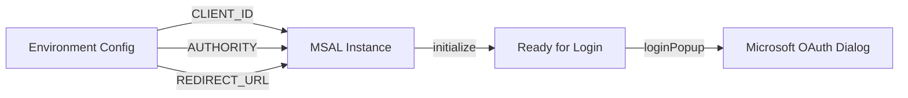
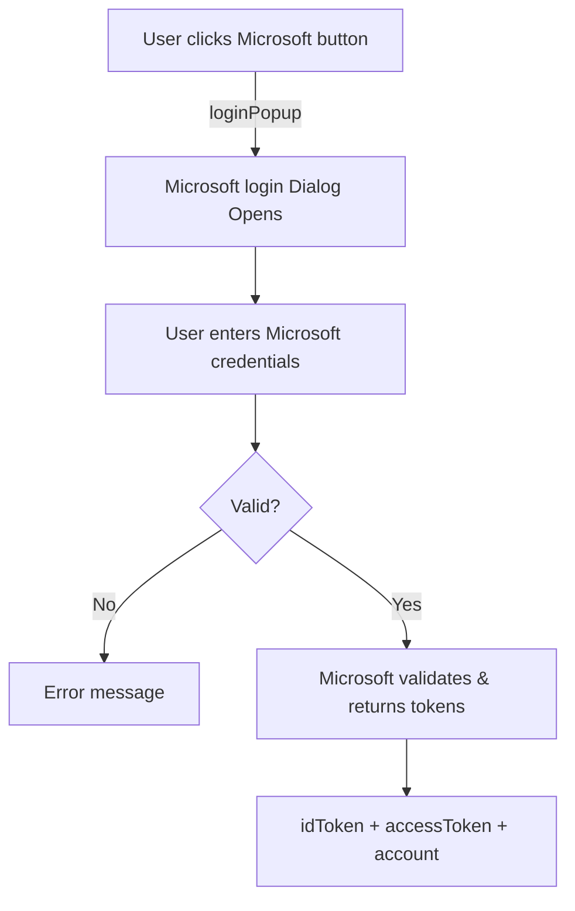
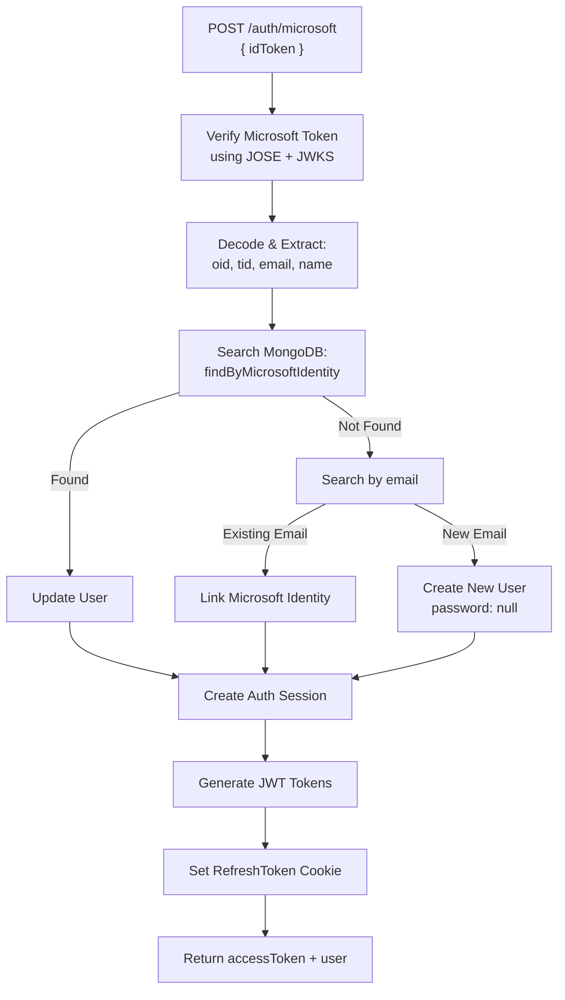
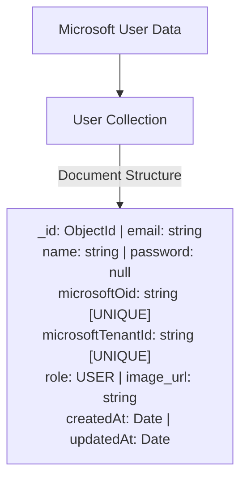
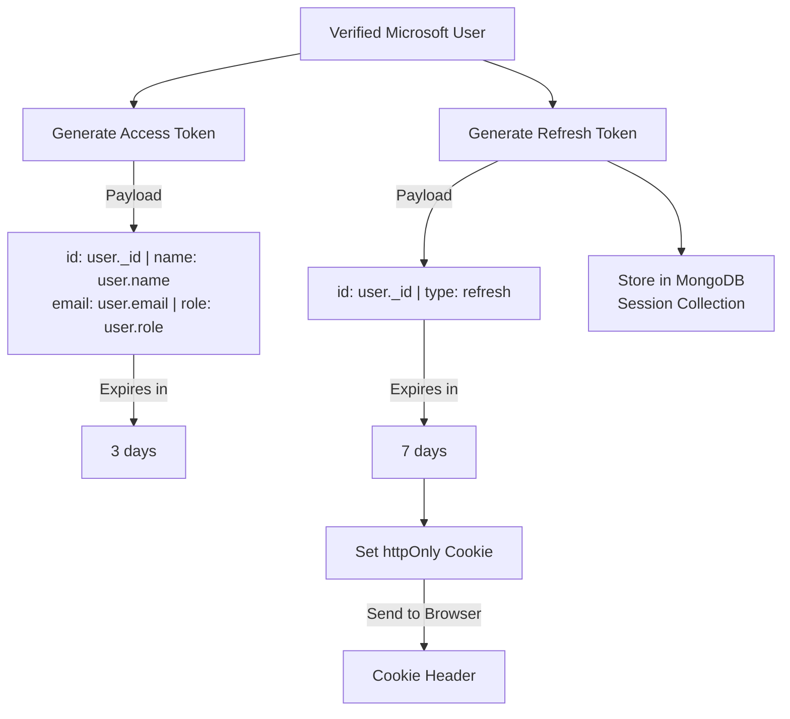
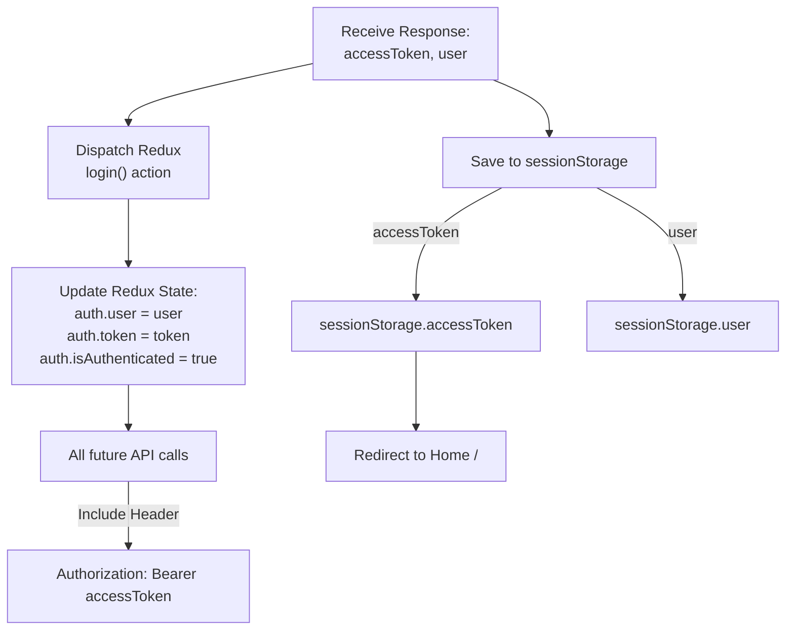
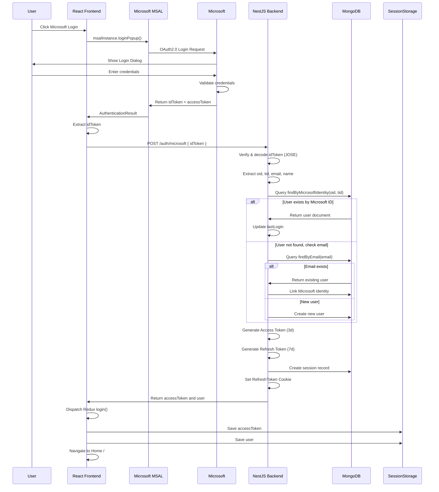
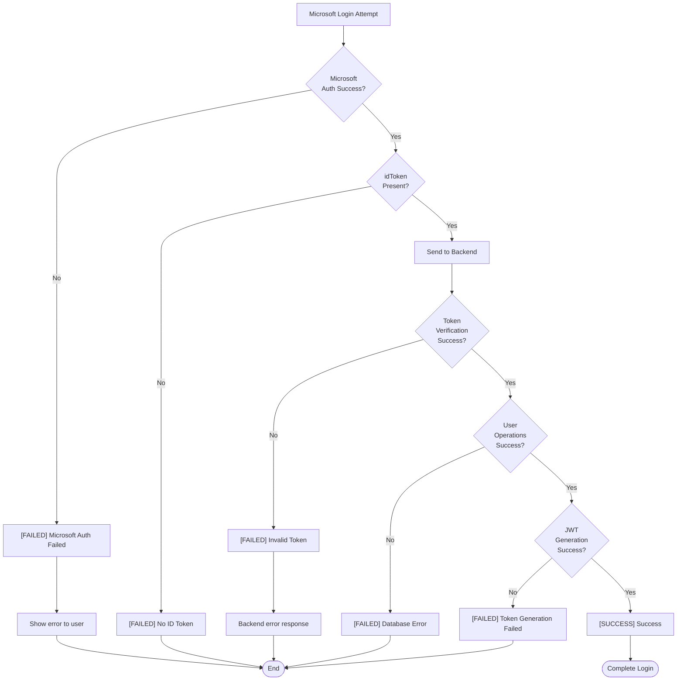

# Microsoft SSO Login Flowchart

## Complete Flow Overview

```mermaid
flowchart TD
    Start([User Clicks Microsoft Login Button]) --> InitMSAL[Initialize MSAL Client<br/>clientId, authority, redirectUri]

    InitMSAL --> MSALConfig["MSAL Configuration<br/>- clientId: environment.CLIENT_ID<br/>- authority: environment.AUTHORITY<br/>- redirectUri: environment.REDIRECT_URL<br/>- cacheLocation: sessionStorage"]

    MSALConfig --> MSALPopup["Call msalInstance.loginPopup<br/>scopes: openid, profile, email"]

    MSALPopup --> MicrosoftDialog["[DIALOG] Microsoft OAuth<br/>(User authenticates with Microsoft)"]

    MicrosoftDialog --> MicrosoftSuccess{Authentication<br/>Successful?}

    MicrosoftSuccess -->|No| MicrosoftError["[ERROR] Authentication Failed<br/>Show error to user"]
    MicrosoftError --> ErrorEnd([End])

    MicrosoftSuccess -->|Yes| GetTokens["Receive from Microsoft:<br/>- idToken<br/>- accessToken<br/>- account"]

    GetTokens --> SetActiveAccount["setActiveAccount<br/>for MSAL"]

    SetActiveAccount --> ExtractIdToken["Extract idToken<br/>from response"]

    ExtractIdToken --> CheckIdToken{idToken<br/>exists?}

    CheckIdToken -->|No| NoTokenError["[ERROR] No ID Token<br/>returned"]
    NoTokenError --> ErrorEnd

    CheckIdToken -->|Yes| SendToBackend["Send to Backend:<br/>POST /auth/microsoft<br/>Body: { idToken }"]

    SendToBackend --> BackendStart["[BACKEND] PROCESSING"]

    BackendStart --> DecodeToken["Decode and Verify<br/>Microsoft idToken<br/>using JOSE/JWKS"]

    DecodeToken --> ExtractMicrosoftData["Extract User Data:<br/>- oid (Object ID)<br/>- tid (Tenant ID)<br/>- email<br/>- name"]

    ExtractMicrosoftData --> FindByOidTid["Query MongoDB:<br/>findByMicrosoftIdentity<br/>oid + tid"]

    FindByOidTid --> UserExists{User<br/>Found?}

    UserExists -->|Yes| UpdateUser["[SUCCESS] Update User:<br/>- Sync name from Microsoft<br/>- Update lastLogin"]
    UpdateUser --> CreateSession

    UserExists -->|No| CheckEmail["Query MongoDB:<br/>findByEmail<br/>email address"]

    CheckEmail --> ExistingEmail{Email<br/>exists?}

    ExistingEmail -->|Yes| LinkIdentity["Link Microsoft Identity<br/>to existing user:<br/>- Set microsoftOid<br/>- Set microsoftTenantId<br/>- Update user data"]
    LinkIdentity --> CreateSession

    ExistingEmail -->|No| CreateNewUser["Create New User:<br/>- email<br/>- name<br/>- microsoftOid<br/>- microsoftTenantId<br/>- password: null"]
    CreateNewUser --> CreateSession["Create Auth Session:<br/>- Generate Access Token<br/>- Generate Refresh Token<br/>- Store in MongoDB"]

    CreateSession --> GenerateJWT["Generate JWT Tokens:<br/>Access: 3 days<br/>Refresh: 7 days"]

    GenerateJWT --> SetCookie["Set Refresh Token Cookie<br/>httpOnly: true | secure: production<br/>sameSite: lax | maxAge: 7 days"]

    SetCookie --> ReturnResponse["Return Response:<br/>accessToken: jwt<br/>user object: id, name, email, role"]

    ReturnResponse --> FrontendReceive["[FRONTEND] RECEIVES<br/>Backend Response"]

    FrontendReceive --> ExtractTokenUser["Extract:<br/>- token (accessToken)<br/>- user object"]

    ExtractTokenUser --> FetchProfile["Optional: Fetch User Profile<br/>GET /auth/profile<br/>with Authorization header"]

    FetchProfile --> DispatchRedux["Dispatch Redux Action:<br/>login({ user, token })"]

    DispatchRedux --> SaveStorage["Save to sessionStorage:<br/>- accessToken<br/>- user (JSON)"]

    SaveStorage --> Navigate["Navigate to Home /"]

    Navigate --> Success([SUCCESS: Login Complete])
```



---

## Flow Breakdown by Component

### **1. Frontend: MSAL Initialization** (React - Login Component)



**Key Files:**

- `ui/src/components/features/Auth/Login/index.tsx` - Main login component
- `ui/src/environment/environment.ts` - Configuration

---

### **2. Microsoft Authentication Dialog**



**Scopes Requested:**

- `openid` - OpenID Connect
- `profile` - User profile info
- `email` - Email address

---

### **3. Backend: Token Verification & User Processing** (NestJS)



**Key Files:**

- `api-nest/src/modules/auth/auth.service.ts` - Main logic
- `api-nest/src/modules/auth/auth.controller.ts` - HTTP endpoint
- `api-nest/src/modules/user/user.service.ts` - User operations

---

### **4. Database: User Schema & Storage**



**Important:**

- [UNIQUE] `microsoftOid` + `microsoftTenantId` - Unique Microsoft identity
- [WARNING] `password: null` - SSO users have no password
- Can link to existing email users

---

### **5. Token Generation & Storage**



---

### **6. Frontend: Session Establishment**



---

## Data Flow Sequence Diagram



---

## Error Handling Flowchart



---

## Key Security Features

### [SECURE] **Token Security**

- Access Token: 3-day expiration
- Refresh Token: 7-day expiration in httpOnly cookie
- Tokens verified with JOSE + Microsoft JWKS

### [SECURE] **Cookie Security**

- `httpOnly: true` - Prevents JavaScript access
- `secure: true` (production) - HTTPS only
- `sameSite: lax` - CSRF protection
- `path: /` - Available across app

### [SECURE] **User Linking**

- Existing email users can link Microsoft account
- Prevents duplicate accounts
- Unique microsoftOid + microsoftTenantId identification

### [SECURE] **Session Management**

- Session stored in MongoDB
- Can be revoked/invalidated
- Refresh token tracked separately

---

## Environment Configuration

```typescript
// environment.ts
{
  CLIENT_ID: "your-client-id@microsoft.com",
  AUTHORITY: "https://login.microsoftonline.com/common",
  REDIRECT_URL: "http://localhost:5173",  // Frontend URL
  APP_API_URL: "http://localhost:3000/api"
}
```

---

## Common Issues & Resolution

| Issue                      | Cause                         | Solution                          |
| -------------------------- | ----------------------------- | --------------------------------- |
| [ERROR] No ID Token        | Token exchange failed         | Check Microsoft app registration  |
| [ERROR] User not found     | Email mismatch                | Verify email in Microsoft account |
| [ERROR] Login page refresh | Token expires                 | Implement refresh token rotation  |
| [ERROR] CORS error         | Backend not allowing frontend | Check cors.config.ts              |
| [ERROR] Cookie not set     | Secure flag on HTTP           | Disable secure: true on localhost |

---

## Testing the Flow

### 1. **Frontend Test**

```javascript
// Open browser console in Login page
console.log(msalInstance); // Should be initialized
console.log(sessionStorage.accessToken); // After login
console.log(sessionStorage.user); // After login
```

### 2. **Backend Test**

```bash
curl -X POST http://localhost:3000/api/auth/microsoft \
  -H "Content-Type: application/json" \
  -d '{"idToken": "eyJhbGc..."}'
```

### 3. **Database Check**

```javascript
// MongoDB - Check user document
db.users.findOne({
  email: "your-email@outlook.com",
});
// Should see: microsoftOid, microsoftTenantId
```
